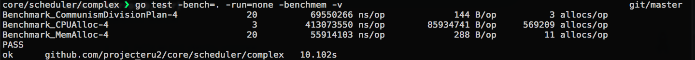

Benchmark
==========

对于编排和调度平台而言，最重要的就是资源分配和调度器的实现，在前面我们介绍了资源分配和调度器的算法，这里我们简单的来对其做一个 Benchmark。

具体的 Benchmark 有:

* [Benchmark_CPUAlloc](https://github.com/projecteru2/core/blob/master/scheduler/complex/potassium_test.go#L787)
* [Benchmark_MemAlloc](https://github.com/projecteru2/core/blob/master/scheduler/complex/potassium_test.go#L805)
* [Benchmark_CommunismDivisionPlan](https://github.com/projecteru2/core/blob/master/scheduler/complex/communism_test.go#L67)

前面2个分别对应于 CPU 优先的分配和 Memory 优先的分配，模拟情况是：

* CPU 优先，10K 节点，每个节点 24 个核，每个核可以提供 10 份运算力，每个容器需要 1.3 份运算力，总共部署 180K 个容器。
* Memory 优先，10K 节点，每个节点 128G 内存，每个容器需要 128M 内存，总共部署 10.24M 个容器。

对于调度算法的模拟情况是

* 10K 节点，每个节点上模拟已经部署随机个容器数 [0, 1024), 还可以部署 1024 个容器，总共部署 10.24M - 1 个容器求其分配。

最后结果在一台 MacBookAir 2013 上半年款的开发机上 (Intel Core i5 1.3G 低电压)，如下图所示：

对于结果我们可以看到:

* CPU 优先分配大概在这个量级的时候一次需要 400ms 左右，还可以继续在内存分配上继续优化。
* MEM 优先分配性能大幅优于 CPU 分配，毕竟算法复杂度要小了不少，即便是上千万的容器资源分配也在 60ms 内能完成。
* 最终平均分布算法一次在 70ms 左右。
