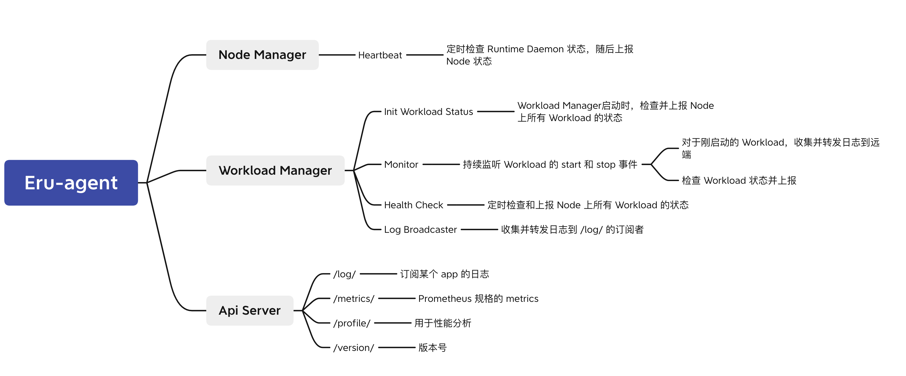
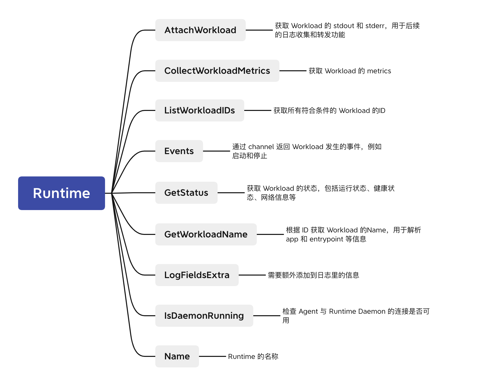

# Agent

### 简介

Agent 主要的功能是：

- 检查 Workload 的状态（例如健康状态、网络信息等），并且上报至 Core
- 检查此 Node 的状态，并且上报至 Core
- 获取并转发 Workload 的日志
- 获取并转发 Metrics

Agent 并没有 HA 机制，建议在一个 Node 上只部署一个 Agent，用于监控这个 Node 及在其上运行的 Workload 的状态。

### 结构

Agent 的主体结构如下图：

和 Core 一样，Agent 并不与 Runtime 类型强耦合。Agent 把所有与运行时相关的逻辑抽象为如下图所示的 `Runtime` 接口，只需要通过简单适配，实现这个接口即可支持任意 Runtime。目前已经支持了 `Docker` 和 `Yavirt`，未来还会支持 `Systemd` 等。

Agent 还做了其它抽象化的工作，例如将 `Core Service` 抽象为 `Store`，将 `ETCD` 抽象为 `KV`。这些抽象不仅增强了扩展性，还为设计单元测试提供了便利。

