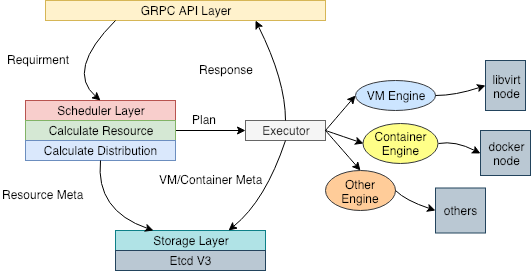

# Architecture

### 系统层面物理架构

>目标是做成可以横向扩展简高可用以及高性能的资源调度核心

物理层面来说，用户操作的 UI 和应用抽象都实现在需要执行实现，现阶段只通过 [cli](https://github.com/projecteru2/cli) 提供命令行支持。它使用 gRPC 与 core 交互，从而的把 App 部署到 Eru 集群之中。

往下则是 Eru 核心组件 [core](https://github.com/projecteru2/core)。core 是无状态的编排调度核心，可以依据集群大小进行横向扩展，其职责是将请求进行调度和编排。按照一定的资源维度调度通过一定的算法计算出资源，编排好之后部署到到一个 Pod 中对应的一个或者多个 Nodes 上。core 之间的共享数据存储在 etcd 之中。

这里的 Pod 是一个逻辑概念，用于描述一组机器（Nodes）。每一个 Pod 都是由一组网络互通的 Node 构成。如果在大二层的层面上可以做到多机房互通的话，Pod 是允许旗下的 Node 也是跨机房的，从而在逻辑层面抹平机房这个概念。

在每一个 Node 上，可以选择这些组件:

- [Docker](https://www.docker.com/)
- [yavirt](https://github.com/projecteru2/yavirt)
- [agent](https://github.com/projecteru2/agent)

其中 agent 是 eru 二元结构中负责在 Node 上监控容器，将日志流打上必要的元信息进行转发，以及 metrics 的收集。agent 可以通过 core 来进行编排部署，因此在 agent 是自举的。

而 yavirt 类似于 docker，是用于提供虚拟机支持。

在我们的实际用况中，我们使用了本地 [rsyslog](http://www.rsyslog.com/) 作为节点日志收集器，并转发到远端。同时通过 [moosefs](https://moosefs.com/index.html) 来实现容器/虚拟机间的文件共享。

### 业务层面

>目标是提供统一的离线在线应用开发流程

逻辑层面上，我们将每个业务逻辑都抽象成一个个 App，由上层平台来管理，并与 SCM 进行了整合，允许进行版本的跟踪。同时，操作 App 的一切工具如日志，如流量管理均在上层平台上进行。总的来说一切 App 生命周期都由上层平台管控着。

在之前的公司里面这个平台称之为 Citadel，目前并未开源。

流量流动上面，可以看到外部世界与 App 的交互均需要通过 [elb](https://github.com/projecteru2/elb)，elb 负责所有 7 层 App 的流量导入，并可以通过不同的 version/entrypoint/url 的组合将流量分流，打入到同一个 App 的某一组不同入口的容器/虚拟机里面。

### App

>抽象出一个或者多个具体的业务，通过不同的入口来区分其功能

应用不是代码本身。应用允许有一个或者多个入口( entrypoint )，每一个入口都代表着不同的功能。

在实际部署的时候，应用用户还可以指定运行时 ENV 来满足环境变量的需求，也可以将本地某配置文件传入到应用运行时，从是实现配置分离。

### 其他组件

- [elb](https://github.com/projecteru2/elb)
- [cli](https://github.com/projecteru2/cli)
- [footstone](https://github.com/projecteru2/footstone)

### 第三方支持

- [Calico](https://www.projectcalico.org/)
- [Macvlan](https://docs.oracle.com/cd/E37670_01/E37355/html/ol_mcvnbr_lxc.html)
- [openresty](https://openresty.org/en/)

