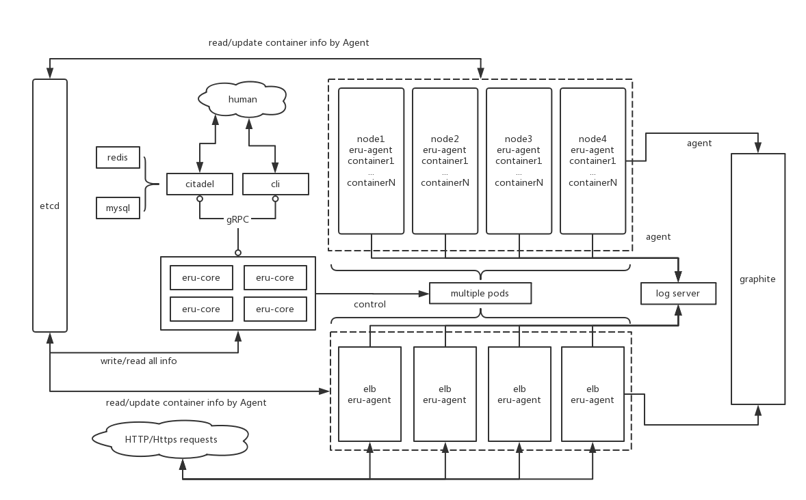

## Quickstart 都做了什么

在运行了 [projecteru2/quickstart](https://github.com/projecteru2/quickstart/) 的后，我们在一台机器上部署了：

1. docker with TLS
2. standalone etcd
3. core
4. agent

在逻辑上，我们使用 `cli pod add eru` 加了一个叫 `eru` 的 pod，并把运行 quickstart 脚本的机器通过 `cli node add eru` 命令加入到了这个 pod 中。core 会自动探测目标 node 的 CPU 和内存，在保留 1G 可用内存的前提下生成 node 的配置文件，存于 etcd 中。

为了方便观察到资源的调度，这个 `eru` pod 我们设置为了 `CPU` 优先。因此这是 `lambda.sh` 中我们可以通过 --cpu 0.01 这样来限制运行容器的资源。node 上每个 CPU 都分成了 100 份计算资源，所以 0.01 意味着最低保证有 1% 的 CPU 资源。

现在你能在这台机器上使用 `erucli` 命令（通过 docker run 执行）来操作这个单机 Eru 了。

## 在生产环境中部署和配置 Eru

首先我们来看看一个典型的 Eru 集群结构是怎样的，如下图：



我们可以看到，一个 Eru 集群是由一组 eru-core 控制多个 pod，每个 pod 中有多个 node，通过这些 node 来部署目标容器/虚拟机。外部流量可以通过 elb 导入到集群中，也可以通过其他的方式。操作人员只需要关注 cli 就好了。那么我们如何部署一个真实的集群呢？

### etcd & docker

对于 Eru 而言必不可少的只有 etcd 和 docker，其中 etcd 承担着数据持久化的角色，类似于 MySQL。因此无论你采用何种 etcd 部署结构，你都需要保证有一个可用于生产环境的 etcd (集群)。这里你可以参考官方的部署[文档](https://github.com/coreos/etcd/blob/master/Documentation/dev-guide/local_cluster.md)。

然后，将需要接入 Eru 的 node 都预先准备好上面的 docker。需要配置的有两项东西，一项是为了保证 core 与 docker daemon 的通讯安全，我们推荐使用 tls 来配置 docker daemon 。另外一项需要注意的是 docker daemon 需要开启 `cluster-store`, 这个选项会通过 etcd 将我们在其上面配置的 SDN 信息共享到其他的 node，如果你有使用 SDN 的话，一定不要忘记配置它。具体可以参考 [quickstart/docker.sh](https://github.com/projecteru2/quickstart/blob/master/docker.sh) 和 [dockerd配置](https://docs.docker.com/engine/reference/commandline/dockerd/)，在 quickstart 的脚本中我们把 docker daemon 的 cluster-store 指向了那个预先安装的 etcd，并启用了 tls，在生产环境中亦是如此。

### (optional) calico

在我们自己用的集群中是使用 Calico 作为 SDN provider 的，如果你也需要用可以参考[calico.sh](https://github.com/projecteru2/quickstart/blob/master/calico.sh) 的初始化步骤。要注意的是，`docker network create` 只需要在任意节点运行一次即可，并不需要运行多次。只要运行了一次之后，以同一个 etcd 作 cluster-store 的 docker daemon 都会知道有了这么一个网络。

另外如果有自己定制化 Calico SDN ACL 需求的，可以参考其[文档](https://docs.projectcalico.org/v2.6/getting-started/docker/)。

### eru-core

现在我们需要找一个地方运行一个或者一组 eru-core。对于高可用的系统而言，我们建议跑多个 eru-core 并在之上通过 LVS/haproxy 的组件来保证起服务高可用。eru-core 在整个集群没有一个 eru-core 的时候是无法完成[自举](https://github.com/projecteru2/core#build-and-deploy-by-eru-itself)的，因此推荐使用 rpm 的方式或者通过原始的 docker run 的方式启动第一个 eru-core。

无论怎样一旦配置好 etcd 并启动 eru-core 之后，eru 集群就可以说准备好了。

### cli

在这一步你需要有一个地方指定 cli 命令，如果是在 CentOS 7 下可以通过 rpm 来安装 eru cli 的 rpm 包（当然你需要先自己打好，可以参考我们的 [make-rpm](https://github.com/projecteru2/cli/blob/master/make-rpm)）。另外一种方式则是使用已有的[镜像](https://hub.docker.com/r/projecteru2/cli)来执行 cli 命令。

假设用镜像的前提下，可以通过以下命令创建 pod:

```
docker run -it --rm \
  --net host \
  projecteru2/cli \
  erucli pod add <PODNAME>
```

如果 `cli` 和 `core` 并非一台机器的话，传入 `ERU` 变量指向正确的地址即可。

在创建完 pod 之后，可以通过以下命令增加 node:

```
docker run -it --rm --privileged \
  --net host \
  -v <TLS_DIR>:/etc/docker/tls \
  projecteru2/cli \
  erucli node add eru
```

在这里我们假定了 `cli` 所运行的机器就是所需要增加的节点，如果是远程操作的话可以通过 `--nodename` 等参数来指定，具体的可以使用 `cli node add --help` 查看。通过 `cli` 工具你能很方便的组建起一个真实的 Pod-Node 结构的集群。我们的 Node 支持 `Label` ，因此在注册的时候可以通过增加这些元信息来进行部署时的节点过滤。

### eru-agent

在准备好 `core` 和 `cli` 后，我们就可以开始部署 `agent` 了。对于 eru 而言，agent 其实不是必须的，当然了如果你需要这些东西的时候，agent 就必须部署上去了。

1. logs forward with meta data
2. metrics collect
3. healthcheck
4. dynamically update container status like publish ip

你可以通过手动部署 agent 也可以通过镜像部署，在 quickstart 中我们是通过 cli 自举部署了 agent，具体可以参考[这里](https://github.com/projecteru2/quickstart/blob/master/agent.sh)。

### (optional) metrics and logs

测试的时候可以使用 nc 来模拟 tcp 服务，在正式生产中如果你有对应的 `logs` 和 `metrics` 服务那是极好不过了。但要记得修改 core 和 agent 对应的配置文件。

最后，ENJOY run container by Eru now!
